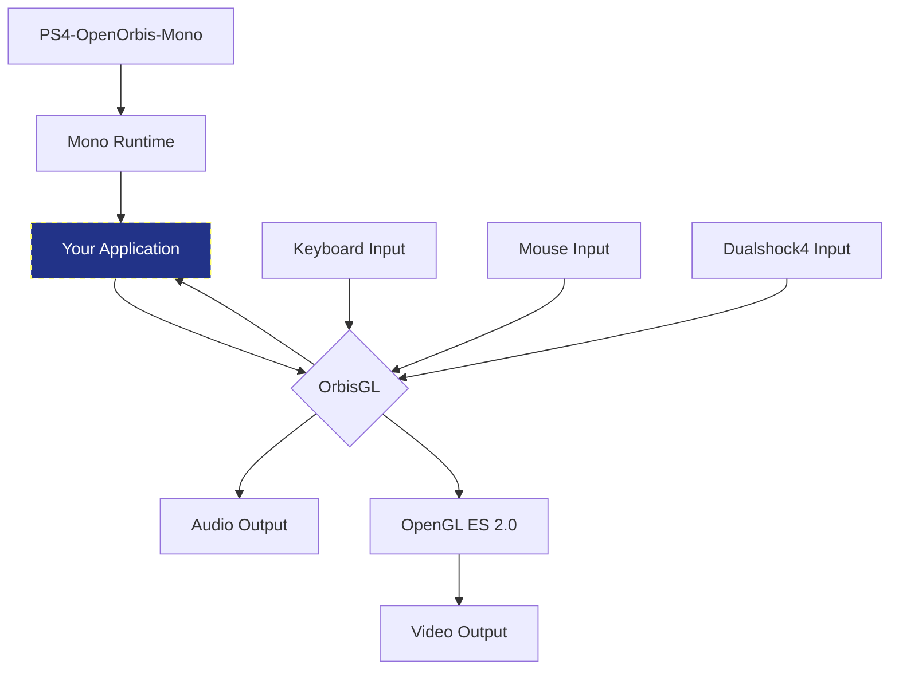

# OrbisGL

OrbisGL is an Open Source graphical user interface framework that facilitates the development of PS4 Homebrews using solely the C# and OpenGL.
This framework encompasses functionalities for rendering fundamental geometric shapes, text, audio playback, and input processing (keyboard, mouse, and DualShock).

# Folders

- **GLTest**: Contains an functional project intended for testing and debugging the library directly on Windows, albeit without support for DualShock input and audio output.
- **ImageSharp**:  Dependency responsible for image decoding.
- **OrbisGL**: Contains the framework itself
- **SharpGLES**: Dependency adapted to enable compatibility with the PS4, integrating OrbisGL with OpenGL.

## Clonning

To download this project and build it, you will need to initialize the submodules as well, this can be done like this:
```sh
git clone https://github.com/marcussacana/OrbisGL
git submodule init
git submodule update --init --recursive
```

## Building

- Clone the repository as shown in [Clonning](#Clonning)
- Open the `OrbisGL.sln` project with Visual Studio or JetBrains Rider (Recommended)
- Restore the Nuget Packages
- Build it!

## Getting Started
- Build the OrbisGL as show in [Building](#Building)
- Create a new empty C# Project
- Add ObisGL as Reference into your project
- Create an new class that derivates the `OrbisGL.GL.Application` class
```csharp
using OrbisGL;
using OrbisGL.GL;
public namespace MyHomebrew {
	public class Entrypoint : Application {
		//Initialize the OrbisGL with resolution of 1920x1080p60 
		public Entrypoint() : base(1920, 1080, 60) {
		}
	}
}
```
- The input methods are all disabled by default, you should initialize it early before create any object in your application
```csharp
public Entrypoint() : base(1920, 1080, 60)
{
    //Enable keyboard input
    EnableKeyboard();

    //Enable mouse Input
    //EnableMouse();

    //Enable Dualshock 4 Input 
    EnableDualshock(new DualshockSettings() 
    {
        //When true, Left Analog moves are mapped to pad buttons
        LeftAnalogAsPad = true, 
        //When true, the pad buttons will act as a focus selector
        PadAsSelector = true,
        ///When set, the Touchpad may be used as an Virtual Mouse
        Mouse = VirtualMouse.Touchpad
    });
}
```
- Now the OpenGL and Input are ready, you may start creating the controllers
```csharp
public Entrypoint() : base(1920, 1080, 60)
{
	//... Initialize Environment
	InitializeComponents();
}

private void InitializeComponents(){
	//Creates an Panel with the screen size
	var BG = new Panel(1920, 1080);
	//This panel will be our root controller
	//and will act as an Background as well.
	
	//This will create a button:
	var BtnHW = new Button(200, 20, 28);
	BtnHW.Text = "Hello World";
	//The constructor parameters of the button specify that
	//the button will have a length of 200px, a height of 20px,
	//and a font size of 28.
	
	//Assign an event for this button,
	BtnHW.OnClicked += (s, a) => { /* BUTTON CLICKED */ };
	//There are three analogous events: OnKeyDown, OnMouseClick, and
	//OnButtonPressed. The distinction lies in the fact that each of these events is
	//triggered exclusively by a specific input method – keyboard, mouse, or DualShock, 
	//respectively. This stands in contrast to OnClicked, which can be activated by any
	//input method.
	
	//This will set the button's position coordinates
	//to X=20 and Y=30. These coordinates are always
	//relative to the parent control.
	BtnHW.Position = new System.Numerics.Vector2(20, 30);


	//This command will cause the previously created
	//button to become a child of the "BG" control.
	BG.AddChild(BtnHW);

	//The AddObject is a method inherent to the Application class
	//from which we previously derived. It can be invoked to append
	//controls or graphical objects to the list of items intended for rendering.
	AddObject(BG);
	//Objects derived from the "Control" class automatically receive
	//input events when activated. On the other hand, "GLObject2D"
	//objects are treated as non-interactive visual items and do
	//not inherently receive any input events.
}
```
- Once everything is configured, you need to invoke the `Run` method, which initializes the main application event loop. You can call this method by simply creating an instance of the class you derived from `Application` and then invoking the `Run();` method at the entry point of your project.
```csharp
//Program.cs

//If you are using the PS4-OpenOrbis-Mono project
//currently the program entrypoint is allways the 
//Orbis.Program.Main method, and not the executable
//entrypoint, So your entrypoint code should look
//exactly like this:
namespace Orbis
{
    public static class Program
    {
        public static void Main(string[] args)
        {
            var Display = new Entrypoint();
            Display.Run();
        }
      
    }
}
```

## OrbisGL Execution Workflow



## Credits

- **PS4-OpenOrbis-Mono**: [LightningMods](https://github.com/LightningMods), [Al-Azif](https://github.com/Al-Azif), [bucanero](https://github.com/bucanero/bucanero), [flatz](https://github.com/flatz), [sleirsgoevy](https://github.com/sleirsgoevy), [OSM-Made](https://github.com/OSM-Made), [OpenOrbis Team](https://github.com/orgs/OpenOrbis/people).
- **OrbisGL**: [marcussacana](https://github.com/marcussacana)
	- **Shaders**: [ShadyBen](https://www.shadertoy.com/user/ShadyBen), [iq](https://www.shadertoy.com/user/iq), [gigaherz](https://www.shadertoy.com/user/gigaherz), [marcussacana](https://github.com/marcussacana)
	- **SharpGLES**: [bitlush](https://github.com/bitlush)
	- **ImageSharp**: [James Jackson-South](https://github.com/jimbobsquarepants), [Dirk Lemstra](https://github.com/dlemstra), [Anton Firsov](https://github.com/antonfirsov), [Scott Williams](https://github.com/tocsoft), [Brian Popow](https://github.com/brianpopow), and the open source contributors.
